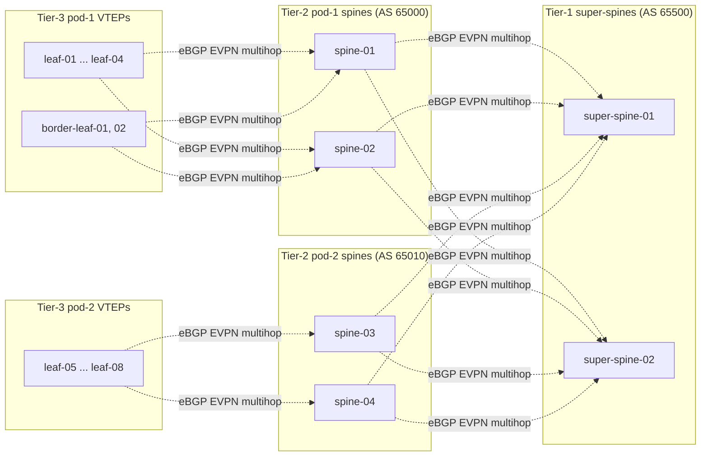

# Network diagram — 5-stage Clos VXLAN/EVPN fabric

High-level architecture of the lab. Renders directly on GitHub thanks to native Mermaid support.

## Physical topology

```mermaid
flowchart TB
  FRR_INET(["🌐 frr-inet · AS 65999<br/>~500 internet prefixes<br/>(simulated DFZ)"])
  ISP_A(["isp-01 · AS 65100"])
  ISP_B(["isp-02 · AS 65200"])

  subgraph BORDER["BORDER LEAVES · pod-1 · dual-homed to both ISPs in VRF TENANT1"]
    direction LR
    BL1["border-leaf-01<br/>AS 65021 · Lo0 10.0.0.21"]
    BL2["border-leaf-02<br/>AS 65022 · Lo0 10.0.0.22"]
  end

  subgraph SUPER["⚡ SUPER-SPINES · TIER-1 · EVPN RR across pods"]
    direction LR
    SS1["super-spine-01<br/>AS 65500 · Lo0 10.0.0.91"]
    SS2["super-spine-02<br/>AS 65500 · Lo0 10.0.0.92"]
  end

  subgraph POD1["━━━━━━━━━━━━━━━━ POD 1 ━━━━━━━━━━━━━━━━"]
    direction TB
    subgraph SPP1["SPINES · TIER-2 · AS 65000"]
      direction LR
      SP1["spine-01 · Lo0 10.0.0.1"]
      SP2["spine-02 · Lo0 10.0.0.2"]
    end
    subgraph LFP1["LEAVES · TIER-3 · VTEPs"]
      direction LR
      L1["leaf-01<br/>AS 65001 · Lo0 10.0.0.11"]
      L2["leaf-02<br/>AS 65002 · Lo0 10.0.0.12"]
      L3["leaf-03<br/>AS 65003 · Lo0 10.0.0.13"]
      L4["leaf-04<br/>AS 65004 · Lo0 10.0.0.14"]
    end
    H1(["16 host PCs · pc1–pc16<br/>4 per leaf · T1×2 · T2 · T3"])
  end

  subgraph POD2["━━━━━━━━━━━━━━━━ POD 2 ━━━━━━━━━━━━━━━━"]
    direction TB
    subgraph SPP2["SPINES · TIER-2 · AS 65010"]
      direction LR
      SP3["spine-03 · Lo0 10.0.0.3"]
      SP4["spine-04 · Lo0 10.0.0.4"]
    end
    subgraph LFP2["LEAVES · TIER-3 · VTEPs"]
      direction LR
      L5["leaf-05<br/>AS 65031 · Lo0 10.0.0.35"]
      L6["leaf-06<br/>AS 65032 · Lo0 10.0.0.36"]
      L7["leaf-07<br/>AS 65033 · Lo0 10.0.0.37"]
      L8["leaf-08<br/>AS 65034 · Lo0 10.0.0.38"]
    end
    H2(["16 host PCs · pc17–pc32<br/>4 per leaf · T1×2 · T2 · T3"])
  end

  FRR_INET ===|"eBGP"| ISP_A
  FRR_INET ===|"eBGP"| ISP_B
  ISP_A ===|"Et1—Et3"| BL1
  ISP_A ===|"Et2—Et3"| BL2
  ISP_B ===|"Et1—Et4"| BL1
  ISP_B ===|"Et2—Et4"| BL2

  BL1 ---|"Et1—Et5"| SP1
  BL1 ---|"Et2—Et5"| SP2
  BL2 ---|"Et1—Et6"| SP1
  BL2 ---|"Et2—Et6"| SP2

  SP1 -.->|"Et7—Et1"| SS1
  SP1 -.->|"Et8—Et1"| SS2
  SP2 -.->|"Et7—Et2"| SS1
  SP2 -.->|"Et8—Et2"| SS2
  SP3 -.->|"Et7—Et3"| SS1
  SP3 -.->|"Et8—Et3"| SS2
  SP4 -.->|"Et7—Et4"| SS1
  SP4 -.->|"Et8—Et4"| SS2

  SP1 ---|"Et1"| L1
  SP1 ---|"Et2"| L2
  SP1 ---|"Et3"| L3
  SP1 ---|"Et4"| L4
  SP2 ---|"Et1"| L1
  SP2 ---|"Et2"| L2
  SP2 ---|"Et3"| L3
  SP2 ---|"Et4"| L4

  SP3 ---|"Et1"| L5
  SP3 ---|"Et2"| L6
  SP3 ---|"Et3"| L7
  SP3 ---|"Et4"| L8
  SP4 ---|"Et1"| L5
  SP4 ---|"Et2"| L6
  SP4 ---|"Et3"| L7
  SP4 ---|"Et4"| L8

  L1 ---|"eth3-6"| H1
  L2 ---|"eth3-6"| H1
  L3 ---|"eth3-6"| H1
  L4 ---|"eth3-6"| H1
  L5 ---|"eth3-6"| H2
  L6 ---|"eth3-6"| H2
  L7 ---|"eth3-6"| H2
  L8 ---|"eth3-6"| H2

  classDef tier1 fill:#2a0f24,stroke:#ec4899,stroke-width:3px,color:#f9a8d4
  classDef tier2 fill:#2a1f0a,stroke:#d29922,stroke-width:2.5px,color:#f0b842
  classDef tier3 fill:#0d2418,stroke:#3fb950,stroke-width:2.5px,color:#7ee787
  classDef border fill:#2a0f1f,stroke:#f778ba,stroke-width:2.5px,color:#ffa7da
  classDef ext   fill:#0d1f2d,stroke:#58a6ff,stroke-width:3px,color:#79c0ff
  classDef hosts fill:#0b2330,stroke:#22d3ee,stroke-width:2px,color:#a5f3fc

  class SS1,SS2 tier1
  class SP1,SP2,SP3,SP4 tier2
  class L1,L2,L3,L4,L5,L6,L7,L8 tier3
  class BL1,BL2 border
  class ISP_A,ISP_B,FRR_INET ext
  class H1,H2 hosts
```



**Legend:**

| Element | Meaning |
|---|---|
| 🔴 Super-spines (pink) | Tier-1, AS 65500, hierarchical EVPN RR — bridges pod-1 ↔ pod-2 |
| 🟡 Pod spines (amber) | Tier-2, AS 65000 (pod-1) / 65010 (pod-2), EVPN RR within their pod |
| 🟢 Leaves (green) | Tier-3 VTEPs, anycast gateways for tenant VRFs |
| 🌸 Border leaves (pink) | Pod-1, eBGP to dual ISPs inside VRF TENANT1 |
| 🔵 ISP / Internet (blue) | isp-01/02 (AS 65100/65200) + frr-inet simulating ~500 DFZ prefixes |
| `═══` | eBGP to external internet |
| `───` | eBGP underlay inside the fabric |
| `-.->` | eBGP-multihop EVPN session (overlay) |

---

## Logical EVPN session topology



VTEPs talk EVPN only to their own pod-spines. Pod-spines reflect to the super-spines. Super-spines reflect across pods, preserving VTEP next-hop (`next-hop-unchanged`) so the VXLAN data plane stays leaf-to-leaf.

---

## Data plane example — `pc1 → pc17` (inter-pod, TENANT1)

Both are in `TENANT1 / VLAN 10`. pc1 is behind leaf-01 (pod-1), pc17 behind leaf-05 (pod-2).

```
 pc1                                                                        pc17
  │                                                                          │
  │  ARP → anycast gw 10.10.10.1                                             │
  │  (leaf-01 SVI answers; resolves remote MAC via EVPN Type-2)              │
  │                                                                          │
  ▼                                                                          ▼
leaf-01 ── VXLAN encap, dst VTEP 10.0.0.35 (leaf-05) ──→ underlay ──→ leaf-05

Hops: leaf-01 → spine-01/02 → super-spine-01/02 → spine-03/04 → leaf-05
                                    (5-stage data path)
```

The **EVPN AS-path** observed at leaf-01 for pc17's MAC:
`65000 → 65500 → 65010 → 65031`
(pod-1 spine → super-spine → pod-2 spine → pod-2 leaf, originated by leaf-05).
